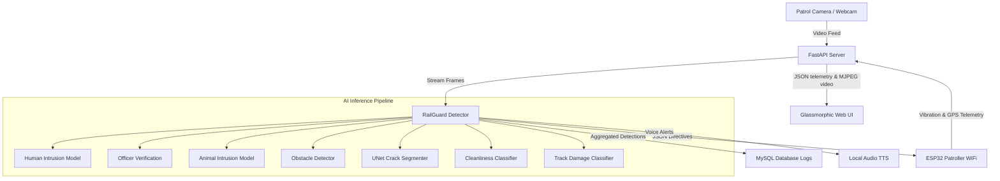

# RailGuard AI: Technical Overview & Documentation

RailGuard AI is a production-grade, modular, real-time Railway Track Monitoring System designed to secure railway infrastructure, track cleanliness, and structural integrity.

## Project Architecture
The system integrates Machine Learning, Deep Learning, Computer Vision, a FastAPI REST Backend, a dark glassmorphic telemetry dashboard, and WiFi actuator communication with an ESP32 patroller.

## Folder Structure
- `database/`: Schema setup and connection pooler with mock in-memory fallback.
- `datasets/`: Preprocessing, augmentations, and synthetic data loader generator.
- `models/`: Unified wrappers and architectures for classifiers and segmenters.
- `training/`: Machine Learning and PyTorch Deep Learning train scripts and pipeline runner.
- `inference/`: Integrated detection algorithms, barcode vest scanner, uniform checker, and TTS voice alert engine.
- `api/`: REST endpoint routing, CORS handling, and video streamer.
- `website/`: Templates and static glassmorphic style sheets.
- `esp32/`: Microcontroller firmwares.
- `utils/`: Common loggers, configuration parameters, and bounding box conversions.
- `docs/`: Guides for deployment and execution.

## Next Steps
For setups, training pipelines, and deployment parameters, see:
1. [INSTALLATION.md](file:///d:/Projects/Railguard%20ai/docs/INSTALLATION.md)
2. [TRAINING.md](file:///d:/Projects/Railguard%20ai/docs/TRAINING.md)
3. [TESTING.md](file:///d:/Projects/Railguard%20ai/docs/TESTING.md)
4. [DEPLOYMENT.md](file:///d:/Projects/Railguard%20ai/docs/DEPLOYMENT.md)
